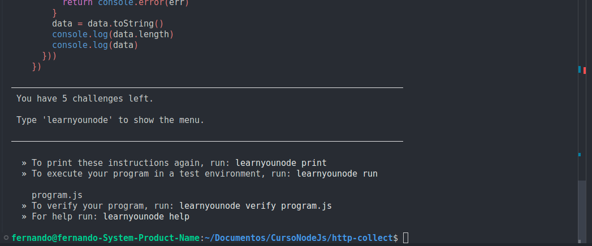

# LEARN YOU THE NODE.JS FOR MUCH WIN!  
   
 ## HTTP COLLECT (Exercise 8 of 13)  
   
  Create a file named http-collect.js.  
   
  Write a program that performs an HTTP GET request to a URL provided to you  
  as the first command-line argument. Collect all data from the server (not  
  just the first "data" event) and then write two lines to the console  
  (stdout).  
   
  The first line you write should just be an integer representing the number  
  of characters received from the server. The second line should contain the  
  complete String of characters sent by the server.  
   
 ─────────────────────────────────────────────────────────────────────────────  
   
 ## HINTS  
   
  There are two approaches you can take to this problem:  
   
  1) Collect data across multiple "data" events and append the results  
  together prior to printing the output. Use the "end" event to determine  
  when the stream is finished and you can write the output.  
   
  2) Use a third-party package to abstract the difficulties involved in  
  collecting an entire stream of data. Two different packages provide a  
  useful API for solving this problem (there are likely more!): bl (Buffer  
  List) and concat-stream; take your pick!  
   
  <https://npmjs.com/bl> <https://npmjs.com/concat-stream>  
   
  To install a Node package, use the Node Package Manager npm. Simply type:  
   
     $ npm install bl  
   
  And it will download and install the latest version of the package into a  
  subdirectory named node_modules. Any package in this subdirectory under  
  your main program file can be loaded with the require syntax without being  
  prefixed by './':  
   
     const bl = require('bl')  
   
  Node will first look in the core modules and then in the node_modules  
  directory where the package is located.  
   
  If you don't have an Internet connection, simply make a node_modules  
  directory and copy the entire directory for the package you want to use  
  from inside the learnyounode installation directory:  
   
  file:///usr/local/lib/node_modules/learnyounode/node_modules/bl  
  file:///usr/local/lib/node_modules/learnyounode/node_modules/concat-stream  
   
  Both bl and concat-stream can have a stream piped in to them and they will  
  collect the data for you. Once the stream has ended, a callback will be  
  fired with the data:  
   
     response.pipe(bl(function (err, data) { /* ... */ }))  
     // or  
     response.pipe(concatStream(function (data) { /* ... */ }))  
   
  Note that you will probably need to data.toString() to convert from a  
  Buffer.  
   
  Documentation for both of these modules has been installed along with  
  learnyounode on your system and you can read them by pointing your browser  
  here:  
   
  file:///usr/local/lib/node_modules/learnyounode/docs/bl.html  
  file:///usr/local/lib/node_modules/learnyounode/docs/concat-stream.html  
   
  Check to see if your program is correct by running this command:  
   
     $ learnyounode verify http-collect.js  
   
 ─────────────────────────────────────────────────────────────────────────────  
   
   » To print these instructions again, run: learnyounode print                  
   » To execute your program in a test environment, run: learnyounode run                                                                            
     program.js                                                                  
   » To verify your program, run: learnyounode verify program.js                 
   » For help run: learnyounode help  

   ## Imagen ilustrativa

   

   