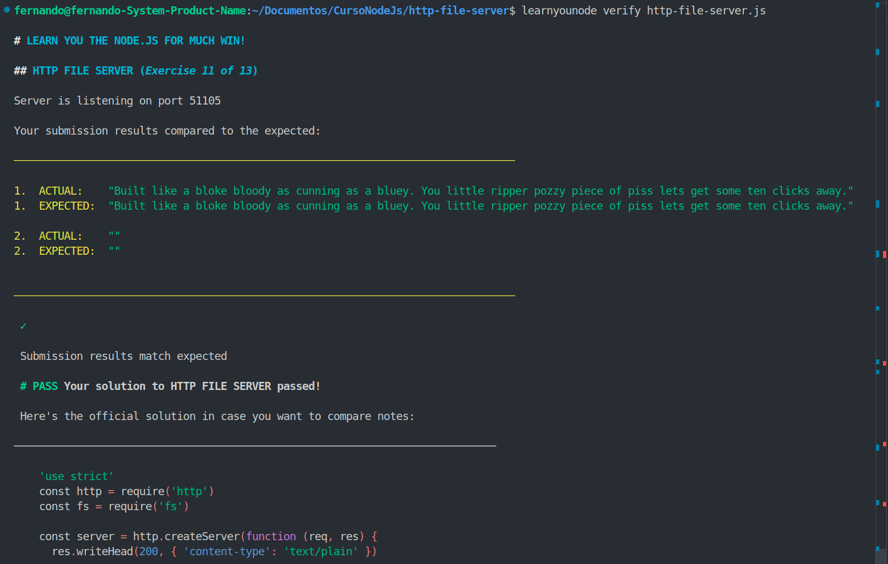

# LEARN YOU THE NODE.JS FOR MUCH WIN!  
   
 ## HTTP FILE SERVER (Exercise 11 of 13)  
   
  Create a file named http-file-server.js.  
   
  Write an HTTP server that serves the same text file for each request it  
  receives.  
   
  Your server should listen on the port provided by the first argument to  
  your program.  
   
  You will be provided with the location of the file to serve as the second  
  command-line argument. You must use the fs.createReadStream() method to  
  stream the file contents to the response.  
   
 ─────────────────────────────────────────────────────────────────────────────  
   
 ## HINTS  
   
  Because we need to create an HTTP server for this exercise rather than a  
  generic TCP server, we should use the http module from Node core. Like the  
  net module, http also has a method named http.createServer() but this one  
  creates a server that can talk HTTP.  
   
  http.createServer() takes a callback that is called once for each  
  connection received by your server. The callback function has the  
  signature:  
   
     function callback (request, response) { /* ... */ }  
   
  Where the two arguments are objects representing the HTTP request and the  
  corresponding response for this request. request is used to fetch  
  properties, such as the header and query-string from the request while  
  response is for sending data to the client, both headers and body.  
   
  Both request and response are also Node streams! Which means that you can  
  use the streaming abstractions to send and receive data if they suit your  
  use-case.  
   
  http.createServer() also returns an instance of your server. You must call  
  server.listen(portNumber) to start listening on a particular port.  
   
  A typical Node HTTP server looks like this:  
   
     const http = require('http')  
     const server = http.createServer(function (req, res) {  
       // request handling logic...  
     })  
     server.listen(8000)  
   
  Documentation on the http module can be found by pointing your browser  
  here:  
  file:///usr/local/lib/node_modules/learnyounode/docs-nodejs/http.html  
   
  The fs core module also has some streaming APIs for files. You will need  
  to use the fs.createReadStream() method to create a stream representing  
  the file you are given as a command-line argument. The method returns a  
  stream object which you can use src.pipe(dst) to pipe the data from the  
  src stream to the dst stream. In this way you can connect a filesystem  
  stream with an HTTP response stream.  
   
  Check to see if your program is correct by running this command:  
   
     $ learnyounode verify http-file-server.js  
   
 ─────────────────────────────────────────────────────────────────────────────  
   
   » To print these instructions again, run: learnyounode print                  
   » To execute your program in a test environment, run: learnyounode run                                                                            
     program.js                                                                  
   » To verify your program, run: learnyounode verify program.js                 
   » For help run: learnyounode help 

   ## Imagen representativa

   
   
   
