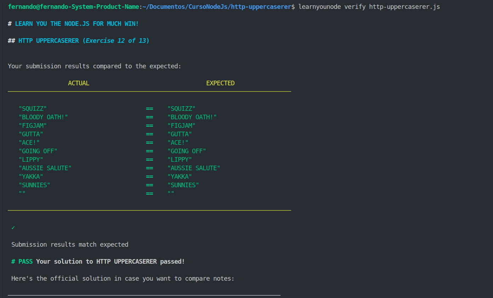

# LEARN YOU THE NODE.JS FOR MUCH WIN!  
   
 ## HTTP UPPERCASERER (Exercise 12 of 13)  
   
  Create a file named http-uppercaserer.js.  
   
  Write an HTTP server that receives only POST requests and converts  
  incoming POST body characters to upper-case and returns it to the client.  
   
  Your server should listen on the port provided by the first argument to  
  your program.  
   
 ─────────────────────────────────────────────────────────────────────────────  
   
 ## HINTS  
   
  While you're not restricted to using the streaming capabilities of the  
  request and response objects, it will be much easier if you do.  
   
  There are a number of different packages in npm that you can use to  
  "transform" stream data as it's passing through. For this exercise the  
  through2-map package offers the simplest API.  
   
  through2-map allows you to create a transform stream using only a single  
  function that takes a chunk of data and returns a chunk of data. It's  
  designed to work much like Array#map() but for streams:  
   
     const map = require('through2-map')  
     inStream.pipe(map(function (chunk) {  
       return chunk.toString().split('').reverse().join('')  
     })).pipe(outStream)  
   
  In the above example, the incoming data from inStream is converted to a  
  String (if it isn't already), the characters are reversed and the result  
  is passed through to outStream. So we've made a chunk character reverser!  
  Remember though that the chunk size is determined up-stream and you have  
  little control over it for incoming data.  
   
  To install through2-map type:  
   
     $ npm install through2-map  
   
  If you don't have an Internet connection, simply make a node_modules  
  directory and copy the entire directory for the module you want to use  
  from inside the learnyounode installation directory:  
   
  file:///usr/local/lib/node_modules/learnyounode/node_modules/through2-map  
   
  Documentation for through2-map has been installed along with learnyounode  
  on your system and you can read them by pointing your browser here:  
   
  file:///usr/local/lib/node_modules/learnyounode/docs/through2-map.html  
   
  Check to see if your program is correct by running this command:  
   
     $ learnyounode verify http-uppercaserer.js  
   
 ─────────────────────────────────────────────────────────────────────────────  
   
   » To print these instructions again, run: learnyounode print                  
   » To execute your program in a test environment, run: learnyounode run                                                                            
     program.js                                                                  
   » To verify your program, run: learnyounode verify program.js                 
   » For help run: learnyounode help  

   ## Imagen representativa

   

   