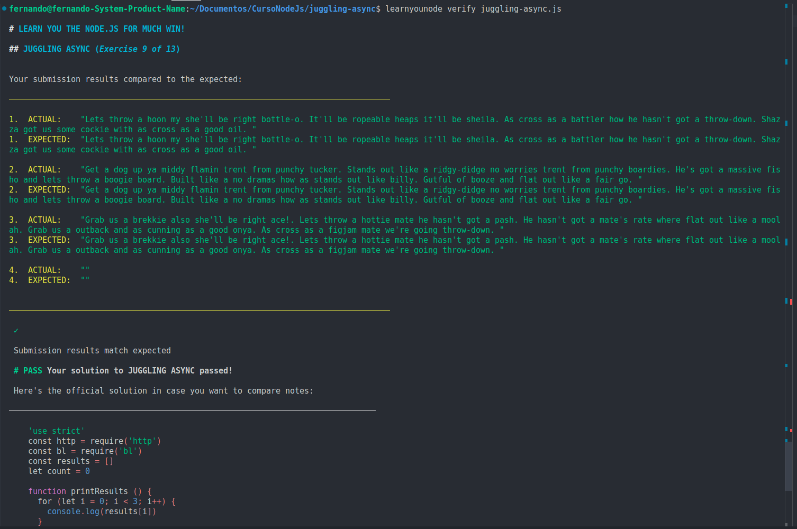
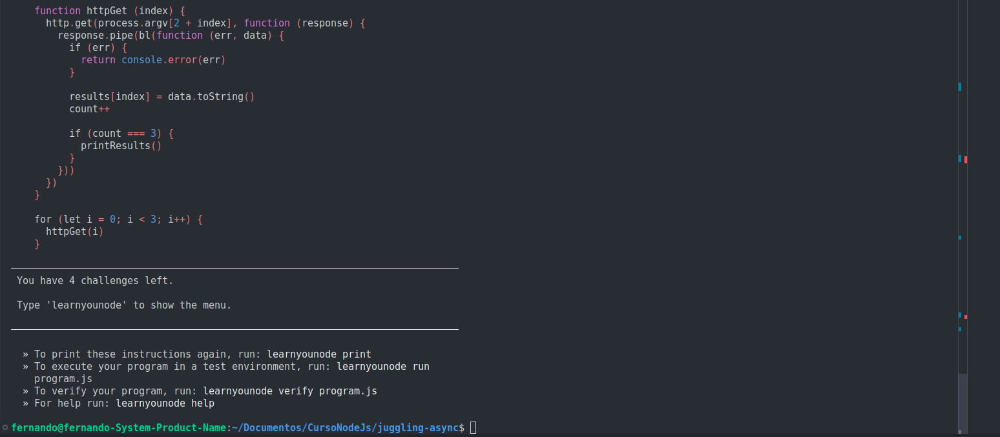

# LEARN YOU THE NODE.JS FOR MUCH WIN!  
   
 ## JUGGLING ASYNC (Exercise 9 of 13)  
   
  Create a file named juggling-async.js.  
   
  This problem is the same as the previous problem (HTTP COLLECT) in that  
  you need to use http.get(). However, this time you will be provided with  
  three URLs as the first three command-line arguments.  
   
  You must collect the complete content provided to you by each of the URLs  
  and print it to the console (stdout). You don't need to print out the  
  length, just the data as a String; one line per URL. The catch is that you  
  must print them out in the same order as the URLs are provided to you as  
  command-line arguments.  
   
 ─────────────────────────────────────────────────────────────────────────────  
   
 ## HINTS  
   
  Don't expect these three servers to play nicely! They are not going to  
  give you complete responses in the order you hope, so you can't naively  
  just print the output as you get it because they will be out of order.  
   
  You will need to queue the results and keep track of how many of the URLs  
  have returned their entire contents. Only once you have them all, you can  
  print the data to the console.  
   
  Counting callbacks is one of the fundamental ways of managing async in  
  Node. Rather than doing it manually, you may find it more convenient to  
  rely on [`async`](https://www.npmjs.com/package/async) or  
  [`run-parallel`](https://www.npmjs.com/package/run-parallel). But for this  
  exercise, do it without that.  
   
  Check to see if your program is correct by running this command:  
   
     $ learnyounode verify juggling-async.js  
   
 ─────────────────────────────────────────────────────────────────────────────  
   
   » To print these instructions again, run: learnyounode print                  
   » To execute your program in a test environment, run: learnyounode run                                                                            
     program.js                                                                  
   » To verify your program, run: learnyounode verify program.js                 
   » For help run: learnyounode help                                             
   

   ## Imagen ilustrativa

   

   