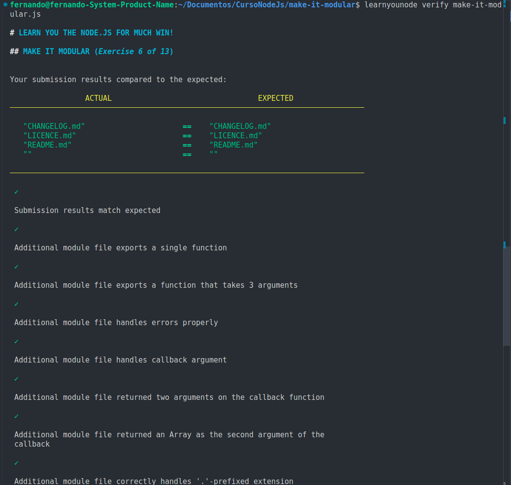
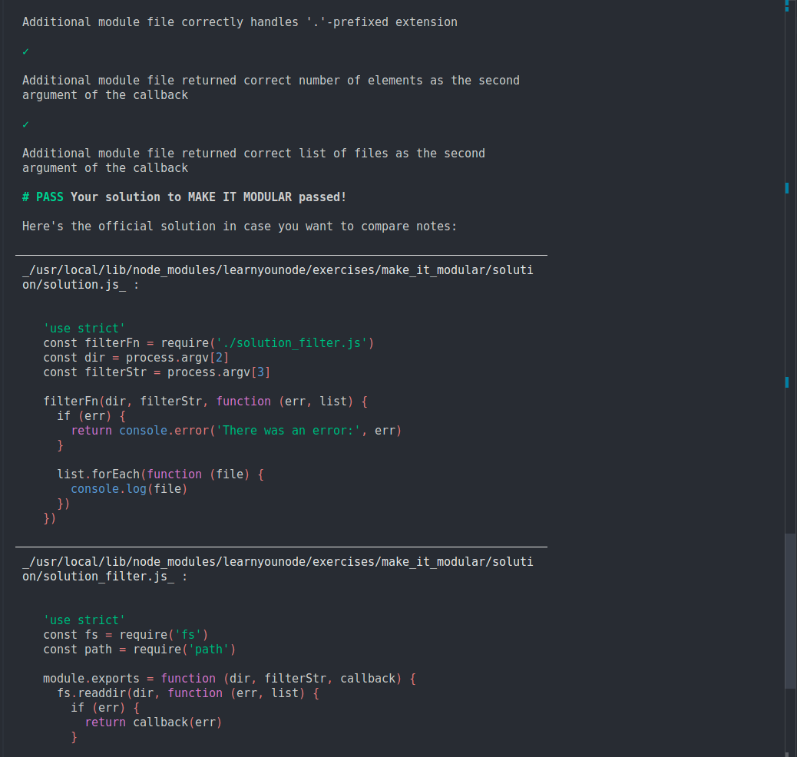
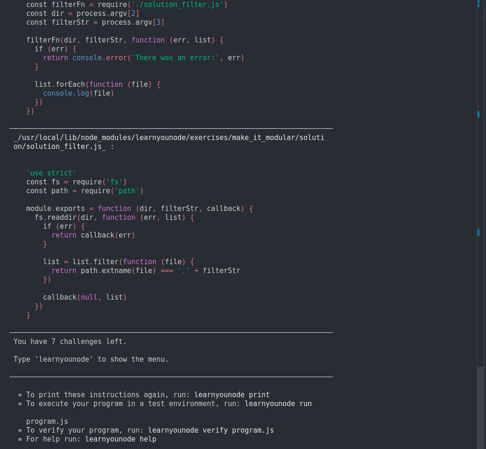

# LEARN YOU THE NODE.JS FOR MUCH WIN!  
   
 ## MAKE IT MODULAR (Exercise 6 of 13)  
   
  Create two files named make-it-modular.js and mymodule.js.  
   
  This problem is the same as the previous but introduces the concept of  
  modules. You will need to create two files to solve this.  
   
  Create a program that prints a list of files in a given directory,  
  filtered by the extension of the files. The first argument is the  
  directory name and the second argument is the extension filter. Print the  
  list of files (one file per line) to the console. You must use  
  asynchronous I/O.  
   
  You must write a module file (mymodule.js) to do most of the work. The  
  module must export a single function that takes three arguments: the  
  directory name, the filename extension string and your callback function,  
  in that order. Don't alter the filename extension string in any way before  
  passing it to your module.  
   
  The callback function must be called using the idiomatic node(err, data)  
  convention. This convention stipulates that unless there's an error, the  
  first argument passed to the callback will be null, and the second will be  
  your data. In this exercise, the data will be your filtered list of files,  
  as an Array. If you receive an error, e.g. from your call to  
  fs.readdir(), the callback must be called with the error as the first and  
  only argument.  
   
  You must not print directly to the console from your module file, only  
  from your original program.  
   
  In the case of an error bubbling up to your original program file, simply  
  check for it and print an informative message to the console.  
   
  These four things are the contract that your module must follow.  
   
   1. Export a single function that takes exactly the arguments described.  
   2. Call the callback exactly once with an error or some data as described.  
   3. Don't change anything else, like global variables or stdout.  
   4. Handle all the errors that may occur and pass them to the callback.  
   
  The benefit of having a contract is that your module can be used by anyone  
  who expects this contract. So your module could be used by anyone else who  
  does learnyounode, or the verifier, and just work.  
   
 ─────────────────────────────────────────────────────────────────────────────  
   
 ## HINTS  
   
  Create a new module by creating a new file (mymodule.js) that just  
  contains your directory reading and filtering function. To define a single  
  function export, you assign your function to the module.exports object,  
  overwriting what is already there:  
   
     module.exports = function (args) { /* ... */ }  
   
  Or you can use a named function and assign the name.  
   
  To use your new module in your original program file (make-it-modular.js),  
  use the require() call in the same way that you require('fs') to load the  
  fs module. The only difference is that for local modules must be prefixed  
  with './'. So, if your file is named mymodule.js then:  
   
     const mymodule = require('./mymodule.js')  
   
  The '.js' is optional here and you will often see it omitted.  
   
  You now have the module.exports object in your module assigned to the  
  mymodule variable. Since you are exporting a single function, mymodule is  
  a function you can call!  
   
  Also keep in mind that it is idiomatic to check for errors and do  
  early-returns within callback functions:  
   
     function bar (callback) {  
       foo(function (err, data) {  
         if (err) { return callback(err) } // early return  
       
         // ... no error, continue doing cool things with `data`  
       
         // all went well, call callback with `null` for the error argument  
       
         callback(null, data)  
       })  
     }  
   
  Check to see if your program is correct by running this command:  
   
     $ learnyounode verify make-it-modular.js  
   
 ─────────────────────────────────────────────────────────────────────────────  
   
   » To print these instructions again, run: learnyounode print                  
   » To execute your program in a test environment, run: learnyounode run                                                                            
     program.js                                                                  
   » To verify your program, run: learnyounode verify program.js                 
   » For help run: learnyounode help 

   ## Imagen ilustrativa

   

   

   