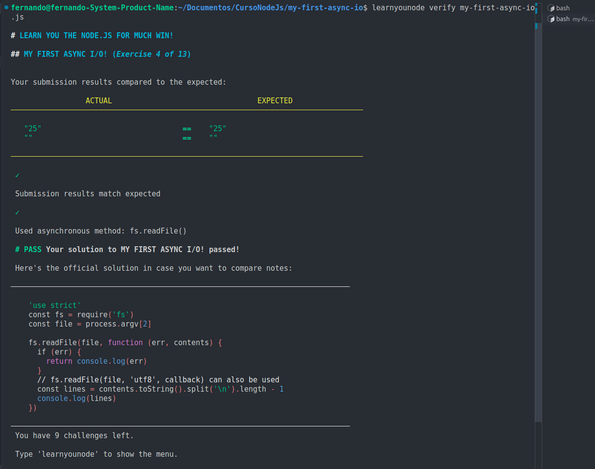

# LEARN YOU THE NODE.JS FOR MUCH WIN!  
   
 ## MY FIRST ASYNC I/O! (Exercise 4 of 13)  
   
  Create a file named my-first-async-io.js.  
   
  Write a program that uses a single asynchronous filesystem operation to  
  read a file and print the number of newlines it contains to the console  
  (stdout), similar to running cat file | wc -l.  
   
  The full path to the file to read will be provided as the first  
  command-line argument.  
   
 ─────────────────────────────────────────────────────────────────────────────  
   
 # HINTS  
   
  The solution to this problem is almost the same as the previous problem  
  except you must now do it the Node.js way: asynchronous.  
   
  Instead of fs.readFileSync() you will want to use fs.readFile() and  
  instead of using the return value of this method you need to collect the  
  value from a callback function that you pass in as the second argument. To  
  learn more about callbacks, check out:  
  (https://github.com/maxogden/art-of-node#callbacks).  
   
  Remember that idiomatic Node.js callbacks normally have the signature:  
   
     function callback (err, data) { /* ... */ }  
   
  so you can check if an error occurred by checking whether the first  
  argument is truthy. If there is no error, you should have your Buffer  
  object as the second argument. As with readFile(), you can supply 'utf8'  
  as the second argument and put the callback as the third argument and you  
  will get a String instead of a Buffer.  
   
  Documentation on the fs module can be found by pointing your browser here:  
  file:///usr/local/lib/node_modules/learnyounode/docs-nodejs/fs.html  
   
  Check to see if your program is correct by running this command:  
   
     $ learnyounode verify my-first-async-io.js  
   
 ─────────────────────────────────────────────────────────────────────────────  
   
   » To print these instructions again, run: learnyounode print                  
   » To execute your program in a test environment, run: learnyounode run                                                                            
     program.js                                                                  
   » To verify your program, run: learnyounode verify program.js                 
   » For help run: learnyounode help                                             
   
   ## Imagen ilustrativa

   