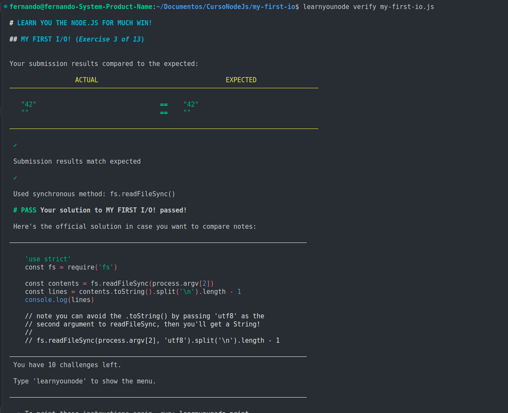

# LEARN YOU THE NODE.JS FOR MUCH WIN!  
   
 ## MY FIRST I/O! (Exercise 3 of 13)  
   
  Create a file named my-first-io.js.  
   
  Write a program that uses a single synchronous filesystem operation to  
  read a file and print the number of newlines (\n) it contains to the  
  console (stdout), similar to running cat file | wc -l.  
   
  The full path to the file to read will be provided as the first  
  command-line argument (i.e., process.argv[2]). You do not need to make  
  your own test file.  
   
 ─────────────────────────────────────────────────────────────────────────────  
   
 ## HINTS  
   
  To perform a filesystem operation you are going to need the fs module from  
  the Node core library. To load this kind of module, or any other "global"  
  module, use the following incantation:  
   
     const fs = require('fs')  
   
  Now you have the full fs module available in a variable named fs.  
   
  All synchronous (or blocking) filesystem methods in the fs module end with  
  'Sync'. To read a file, you'll need to use  
  fs.readFileSync('/path/to/file'). This method will return a Buffer object  
  containing the complete contents of the file.  
   
  Documentation on the fs module can be found by pointing your browser here:  
  file:///usr/local/lib/node_modules/learnyounode/docs-nodejs/fs.html  
   
  Buffer objects are Node's way of efficiently representing arbitrary arrays  
  of data, whether it be ascii, binary or some other format. Buffer objects  
  can be converted to strings by simply calling the toString() method on  
  them. e.g. const str = buf.toString().  
   
  Documentation on Buffers can be found by pointing your browser here:  
  file:///usr/local/lib/node_modules/learnyounode/docs-nodejs/buffer.html  
   
  If you're looking for an easy way to count the number of newlines in a  
  string, recall that a JavaScript String can be .split() into an array of  
  substrings and that '\n' can be used as a delimiter. Note that the test  
  file does not have a newline character ('\n') at the end of the last line,  
  so using this method you'll end up with an array that has one more element  
  than the number of newlines.  
   
  Check to see if your program is correct by running this command:  
   
     $ learnyounode verify my-first-io.js  
   
 ─────────────────────────────────────────────────────────────────────────────  
   
   » To print these instructions again, run: learnyounode print                  
   » To execute your program in a test environment, run: learnyounode run                                                                            
     program.js                                                                  
   » To verify your program, run: learnyounode verify program.js                 
   » For help run: learnyounode help 

   ## Imagen ilustrativa

   