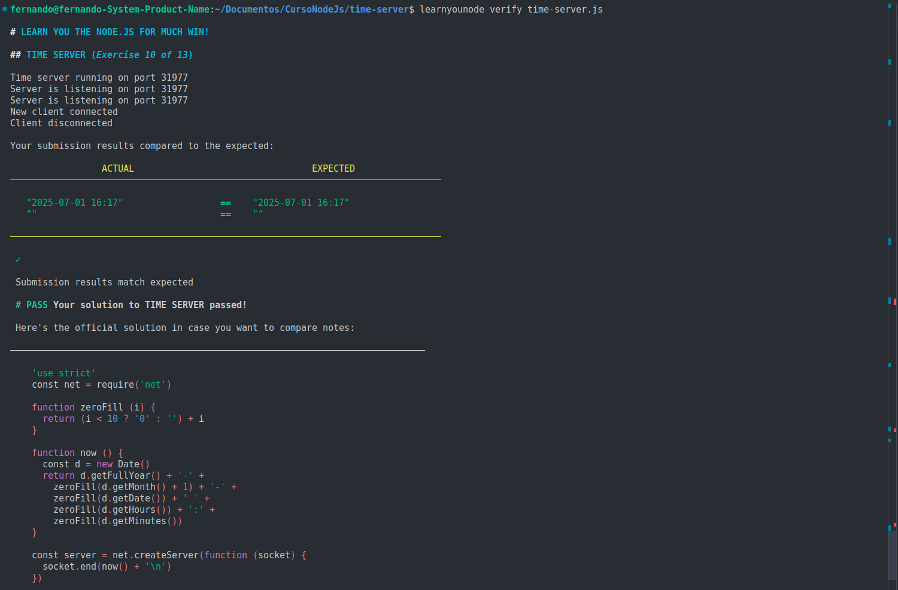
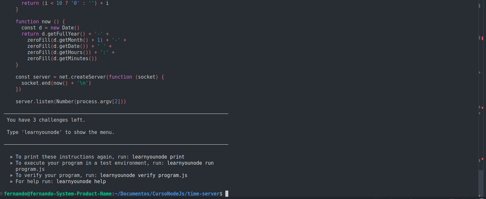

# LEARN YOU THE NODE.JS FOR MUCH WIN!  
   
 ## TIME SERVER (Exercise 10 of 13)  
   
  Create a file named time-server.js.  
   
  Write a TCP time server!  
   
  Your server should listen to TCP connections on the port provided by the  
  first argument to your program. For each connection you must write the  
  current date & 24 hour time in the format:  
   
     "YYYY-MM-DD hh:mm"  
   
  followed by a newline character. Month, day, hour and minute must be  
  zero-filled to 2 integers. For example:  
   
     "2013-07-06 17:42"  
   
  After sending the string, close the connection.  
   
 ─────────────────────────────────────────────────────────────────────────────  
   
 ## HINTS  
   
  For this exercise we'll be creating a raw TCP server. There's no HTTP  
  involved here so we need to use the net module from Node core which has  
  all the basic networking functions.  
   
  The net module has a method named net.createServer() that takes a  
  function. The function that you need to pass to net.createServer() is a  
  connection listener that is called more than once. Every connection  
  received by your server triggers another call to the listener. The  
  listener function has the signature:  
   
     function listener (socket) { /* ... */ }  
   
  net.createServer() also returns an instance of your server. You must call  
  server.listen(portNumber) to start listening on a particular port.  
   
  A typical Node TCP server looks like this:  
   
     const net = require('net')  
     const server = net.createServer(function (socket) {  
       // socket handling logic  
     })  
     server.listen(8000)  
   
  Remember to use the port number supplied to you as the first command-line  
  argument.  
   
  The socket object contains a lot of meta-data regarding the connection,  
  but it is also a Node duplex Stream, in that it can be both read from, and  
  written to. For this exercise we only need to write data and then close  
  the socket.  
   
  Use socket.write(data) to write data to the socket and socket.end() to  
  close the socket. Alternatively, the .end() method also takes a data  
  object so you can simplify to just: socket.end(data).  
   
  Documentation on the net module can be found by pointing your browser  
  here:  
   
  file:///usr/local/lib/node_modules/learnyounode/docs-nodejs/net.html  
   
  To create the date, you'll need to create a custom format from a new  
  Date() object. The methods that will be useful are:  
   
     date.getFullYear()  
     date.getMonth() // starts at 0  
     date.getDate() // returns the day of month  
     date.getHours()  
     date.getMinutes()  
   
  Or, if you want to be adventurous, use the strftime package from npm. The  
  strftime(fmt, date) function takes date formats just like the unix date  
  command. You can read more about strftime at:  
  (https://github.com/samsonjs/strftime)  
   
  Check to see if your program is correct by running this command:  
   
     $ learnyounode verify time-server.js  
   
 ─────────────────────────────────────────────────────────────────────────────  
   
   » To print these instructions again, run: learnyounode print                  
   » To execute your program in a test environment, run: learnyounode run                                                                            
     program.js                                                                  
   » To verify your program, run: learnyounode verify program.js                 
   » For help run: learnyounode help 

   ## Imagen ilustrativa

   

   